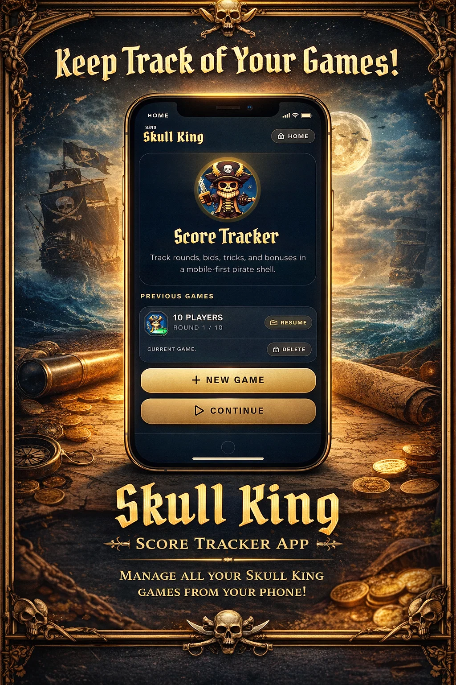

# Skull King Tracker


# Introduction

Skull King Score Tracker is a mobile-first Next.js app for running Skull King games quickly. It helps players set up a crew, track round inputs, calculate scores, review standings, and revisit saved games.

*This was developped for personal usage (code is not maintainable if we rate it from a high-end SWE perspective)*
# Technologies

- Next.js 16
- React 19
- TypeScript
- Tailwind CSS 4
- Lucide React

# Usage

Install dependencies and start the development server:

```bash
bun install
bun run dev
```

Build for production:

```bash
bun run build
bun run start
```

# Author

Med
